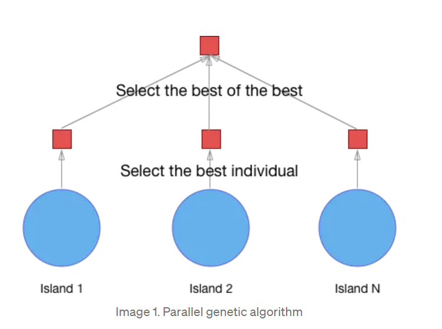
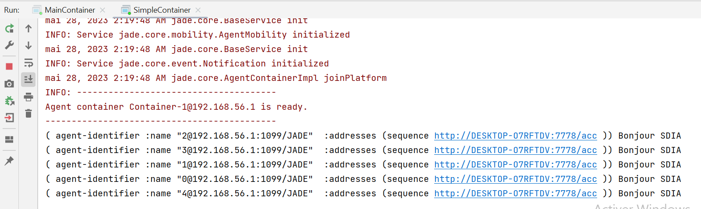

# Parallel genetic algorithm : Island models
Island models are a type of parallel genetic algorithm (PGA) that divide the population into multiple subpopulations, often referred to as islands. Each island operates independently, performing its own selection, crossover, and mutation operations. Periodically, individuals are exchanged or migrated between islands to promote information sharing and diversification.

The concept of island models is inspired by the idea that in nature, isolated populations can evolve differently due to factors like geographic separation, limited gene flow, and unique environmental conditions. Similarly, in island models, the subpopulations evolve independently, potentially exploring different regions of the solution space and maintaining diversity.

The migration process in island models plays a crucial role in promoting diversity and preventing islands from getting trapped in local optima. By exchanging individuals, the algorithm can propagate beneficial genetic material across islands, potentially accelerating convergence towards high-quality solutions.

The frequency and size of migrations, as well as the selection criteria for migrants, are parameters that can be tuned in island models. Additionally, strategies such as elitism (preserving the best individuals) and niche formation (encouraging diversity within islands) can be incorporated to enhance exploration and exploitation.

Island models have been found to be effective in solving complex optimization problems, as they combine the benefits of parallel processing with the preservation of diversity and exploration capabilities. By allowing subpopulations to evolve independently and share information periodically, island models strike a balance between local and global search, leading to improved overall performance.



### Agent Island class 
The agent initializes a population of individuals and performs selection, crossover, and mutation operations on them. It calculates the fitness of each individual, sorts the population based on fitness, and evolves the population over multiple generations. The island model allows for information exchange between subpopulations, enhancing exploration and maintaining diversity. The code demonstrates the basic structure and functionality of the agent within the island model framework.

```
import jade.core.Agent;
import jade.core.behaviours.Behaviour;
import jade.core.behaviours.OneShotBehaviour;
import jade.core.behaviours.SequentialBehaviour;
import jade.domain.DFService;
import jade.domain.FIPAAgentManagement.DFAgentDescription;
import jade.domain.FIPAAgentManagement.ServiceDescription;
import jade.domain.FIPAException;
import jade.lang.acl.ACLMessage;

import java.util.*;

public class AgentIsland extends Agent {
    List<Individual> individuals=new ArrayList<>();
    Individual firstFitness;
    Individual secondFitness;
    Random rnd=new Random();
    @Override
    protected void setup() {

       SequentialBehaviour sequentialBehaviour=new SequentialBehaviour();
        sequentialBehaviour.addSubBehaviour(new OneShotBehaviour() {
            @Override
            public void action() {
                initialaizePopulation();
                calculateIndFintess();
                sortPopulation();

            }
        });
        sequentialBehaviour.addSubBehaviour(new Behaviour() {
            int it=0;
            @Override
            public void action() {
                selection();
                crossover();
                mutation();
                calculateIndFintess();
                sortPopulation();
                it++;
            }

            @Override
            public boolean done() {
                return it==GAUtils.MAX_IT || getFitnessIndivd().getFitness()==GAUtils.Max_Fitness;
            }
        });
        sequentialBehaviour.addSubBehaviour(new OneShotBehaviour() {
            @Override
            public void action() {
                DFAgentDescription dfAgentDescription=new DFAgentDescription();
                ServiceDescription serviceDescription=new ServiceDescription();
                serviceDescription.setType("ga");
                dfAgentDescription.addServices(serviceDescription);
                DFAgentDescription[] dfAgentDescriptions;
                try {
                 dfAgentDescriptions=DFService.search(getAgent(),dfAgentDescription);
                } catch (FIPAException e) {
                    throw new RuntimeException(e);
                }
                ACLMessage aclMessage=new ACLMessage(ACLMessage.INFORM);
                aclMessage.addReceiver(dfAgentDescriptions[0].getName());
                aclMessage.setContent(String.valueOf(getFitnessIndivd().getGenes()));
                send(aclMessage);
            }
        });
    addBehaviour(sequentialBehaviour);
    }
    public void initialaizePopulation(){
        for (int i=0;i<GAUtils.POPULATION_SIZE;i++){
            individuals.add(new Individual());
        }
    }
    public void calculateIndFintess(){
        for (int i=0;i<GAUtils.POPULATION_SIZE;i++){
            individuals.get(i).calculateFitness();
        }

    }
    public void selection(){
        firstFitness=individuals.get(0);
        secondFitness=individuals.get(1);
    }
    //croisement
    public void crossover(){

        int pointCroisment=rnd.nextInt(5);
        pointCroisment++;
        Individual individual1=new Individual();
        Individual individual2=new Individual();
        for (int i=0;i<individual1.getGenes().length;i++) {
            individual1.getGenes()[i]=firstFitness.getGenes()[i];
            individual2.getGenes()[i]=secondFitness.getGenes()[i];
        }
        for (int i=0;i<pointCroisment;i++) {
            individual1.getGenes()[i]=secondFitness.getGenes()[i];
            individual2.getGenes()[i]=firstFitness.getGenes()[i];
        }
        //System.out.println(Arrays.toString(individual1.getGenes()));
        //System.out.println(Arrays.toString(individual2.getGenes()));

        individuals.set(individuals.size()-2,individual1);
        individuals.set(individuals.size()-1,individual2);
    }
    public void mutation(){
        int index=rnd.nextInt(GAUtils.Max_Fitness);
        if (rnd.nextDouble()<GAUtils.MUTATION_PROB){
            individuals.get(individuals.size()-2).getGenes()[index]=GAUtils.CHARATERS.charAt(rnd.nextInt(GAUtils.CHARATERS.length()));
        }
        index=rnd.nextInt(GAUtils.Max_Fitness);
        if (rnd.nextDouble()<GAUtils.MUTATION_PROB){
            individuals.get(individuals.size()-1).getGenes()[index]=GAUtils.CHARATERS.charAt(rnd.nextInt(GAUtils.CHARATERS.length()));
        }


    }

    public List<Individual> getIndividuals() {
        return individuals;
    }
    public void sortPopulation(){
        Collections.sort(individuals,Collections.reverseOrder());
    }
    public Individual getFitnessIndivd(){
        return individuals.get(0);}
    @Override
    protected void takeDown(){
        try {
            DFService.deregister(this);
        } catch (FIPAException e) {
            throw new RuntimeException(e);
        }
    }
}
```
## Agent Master class 
The agent sets up its description and registers itself as a "master" agent providing the "ga" (genetic algorithm) service. It utilizes the FIPA protocols for communication and interacts with other agents in the system. The setup() method also includes a CyclicBehaviour that continuously listens for incoming messages. When a message is received, it prints the sender's information and the content of the message. This agent acts as the central coordinator or supervisor, responsible for managing and coordinating the activities of other agents involved in the genetic algorithm process.
```
import jade.core.Agent;
import jade.core.behaviours.CyclicBehaviour;
import jade.domain.DFService;
import jade.domain.FIPAAgentManagement.DFAgentDescription;
import jade.domain.FIPAAgentManagement.ServiceDescription;
import jade.domain.FIPAException;
import jade.lang.acl.ACLMessage;

public class AgentMaster extends Agent {
    @Override
    protected void setup(){
        DFAgentDescription dfAgentDescription=new DFAgentDescription();
        dfAgentDescription.setName(getAID());
        ServiceDescription serviceDescription=new ServiceDescription();
        serviceDescription.setType("ga");
        serviceDescription.setName("master");
        dfAgentDescription.addServices(serviceDescription);
        try {
            DFService.register(this,dfAgentDescription);
        } catch (FIPAException e) {
            e.printStackTrace();
        }
        addBehaviour(new CyclicBehaviour() {
            @Override
            public void action() {
                ACLMessage aclMessage=receive();
                if(aclMessage!=null){
                    System.out.println(aclMessage.getSender()+" "+aclMessage.getContent());

                }else {
                    block();
                }

            }
        });
    }

}
```
## Agent Fitness class
"AgentFitness" class represents the fitness of an agent in a multi-agent system. It has two private member variables: aid, which represents the AID (Agent ID) of the agent, and fitness, which holds the fitness value associated with the agent. The class provides a constructor to initialize the aid and fitness values, as well as getter and setter methods for both variables.

The class also implements the Comparable interface, which enables instances of AgentFitness to be compared and ordered based on their fitness values. The compareTo() method compares the fitness of two instances of AgentFitness, allowing them to be sorted in ascending or descending order. The method returns a positive integer if the current instance's fitness is greater than the compared instance's fitness, a negative integer if it is lesser, and zero if the fitness values are equal.

Overall, the AgentFitness class serves as a convenient way to associate agents with their corresponding fitness values and enables sorting and comparison operations based on their fitness in the context of a genetic algorithm or optimization process.
```
import jade.core.AID;

public class AgentFitness implements Comparable{
    private AID aid;
    private int fitness;

    public AgentFitness(AID aid, int fitness) {
        this.aid = aid;
        this.fitness = fitness;
    }

    public AID getAid() {
        return aid;
    }

    public void setAid(AID aid) {
        this.aid = aid;
    }

    public int getFitness() {
        return fitness;
    }

    public void setFitness(int fitness) {
        this.fitness = fitness;
    }
    @Override
    public int compareTo(Object o) {
        AgentFitness agentFitness=(AgentFitness) o;
        if (this.fitness>agentFitness.fitness)
            return 1;
        else if(this.fitness<agentFitness.fitness){
            return -1;
        }else
            return 0;
    }
}

```
## Individual class
"Individual" class represents an individual in a genetic algorithm. An individual is characterized by its genes, stored in the genes array, and its fitness value, stored in the fitness variable.

The class includes a constructor that randomly initializes the genes of the individual using characters from the GAUtils.CHARATERS string. The calculateFitness() method evaluates the fitness of the individual by comparing its genes with a predefined solution stored in GAUtils.SOLUTION. Each matching gene increments the fitness value by 1.

The class implements the Comparable interface, allowing instances of the Individual class to be compared and sorted based on their fitness values. The compareTo() method compares the fitness of two individuals and returns a positive integer if the current instance has higher fitness, a negative integer if it has lower fitness, and zero if the fitness values are equal.

Overall, the Individual class represents a single candidate solution in a genetic algorithm, with its genes encoding the potential solution and its fitness reflecting the quality or performance of that solution. It provides methods for initialization, fitness calculation, and comparison, making it suitable for use within a larger genetic algorithm framework.

```
import java.util.Random;
public class Individual implements Comparable{
    //Bonjour
    //chromosome
    private char genes[]=new char[GAUtils.Max_Fitness];
    private int fitness;

    public Individual() {
        Random rnd=new Random();
        for (int i=0;i<genes.length;i++){
            genes[i]= GAUtils.CHARATERS.charAt(rnd.nextInt(GAUtils.CHARATERS.length()));
        }
    }
    public void calculateFitness(){
        fitness=0;
        for (int i=0;i<GAUtils.Max_Fitness;i++) {
            if(genes[i]==GAUtils.SOLUTION.charAt(i))
                fitness+=1;
        }
    }

    public char[] getGenes() {
        return genes;
    }

    public void setGenes(char[] genes) {
        this.genes = genes;
    }

    public int getFitness() {
        return fitness;
    }

    public void setFitness(int fitness) {
        this.fitness = fitness;
    }

    @Override
    public int compareTo(Object o) {
        Individual individual=(Individual) o;
        if (this.fitness>individual.fitness)
            return 1;
        else if(this.fitness<individual.fitness){
            return -1;
        }else
            return 0;
    }
}

```

## GAUtils class 
```
public class GAUtils {
public static final int MAX_IT=4000;
public static final int POPULATION_SIZE=100;
public static final int Max_Fitness=12;
public static final String SOLUTION="Bonjour SDIA";
public static final int Island_size=5;
public static final String CHARATERS="abcdefghijklmnopqrstuvwxyzABCDEFGHIJKLMNOPQRSTUVWXYZ ";
public static final double MUTATION_PROB=0.5;
}
```
## Main Container class 
The main method initializes the JADE runtime, sets the GUI parameter to "true" using a profile, creates the main container with the specified profile settings, and then starts the container. This setup enables the container to manage and interact with agents in a multi-agent system.
```
import jade.core.Profile;
import jade.core.ProfileImpl;
import jade.core.Runtime;
import jade.wrapper.AgentContainer;
import jade.wrapper.ControllerException;

public class MainContainer {
    public static void main(String[] args) throws ControllerException {
        Runtime runtime=Runtime.instance();
        ProfileImpl profile=new ProfileImpl();
        profile.setParameter(Profile.GUI,"true");
        AgentContainer mainContainer = runtime.createMainContainer(profile);
        mainContainer.start();
    }
}

```
## Simple Container class 
The code proceeds to create and start two types of agents: an "AgentMaster" agent named "mainAgent" and multiple "AgentIsland" agents with unique identifiers. Each agent is created using the createNewAgent method on the agent container and is started with the start method on the corresponding AgentController.

Overall, this code snippet demonstrates the creation of a JADE container and the instantiation of multiple agents within that container. These agents can perform specific tasks, communicate with each other, and participate in a multi-agent system orchestrated by the JADE framework.
```
import jade.core.Profile;
import jade.core.ProfileImpl;
import jade.core.Runtime;
import jade.wrapper.AgentContainer;
import jade.wrapper.AgentController;
import jade.wrapper.ControllerException;

public class SimpleContainer {
    public static void main(String[] args) throws ControllerException {
        Runtime runtime=Runtime.instance();
        ProfileImpl profile=new ProfileImpl();
        profile.setParameter(Profile.MAIN_HOST,"localhost");
        AgentContainer agentContainer = runtime.createAgentContainer(profile);
        AgentController masterAgent=agentContainer.createNewAgent("mainAgent", AgentMaster.class.getName(), new Object[]{});
        masterAgent.start();
        for (int i=0;i < GAUtils.Island_size;i++){
            AgentController islandAgent=agentContainer.createNewAgent(String.valueOf(i), AgentIsland.class.getName(), new Object[]{});
            islandAgent.start();
        }
    }
}

```
## Execution 




